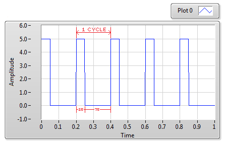
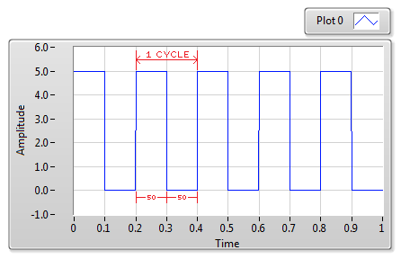
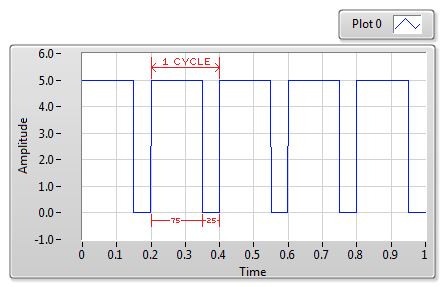
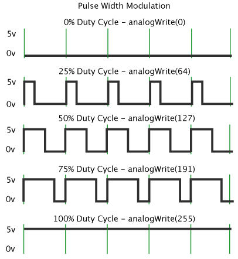
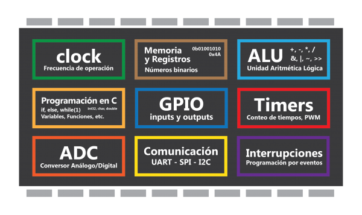

# __Introducción a la Electricidad y Electrónica__

  

# Electricidad y Electrónica

Aquí se presenta una visión general simplificada de la electrónica necesaria para la robótica práctica. Apenas estaremos arañando la superficie de la ciencia y la tecnología detrás de la electrónica. Para un conocimiento más profundo, planificaremos talleres mas avanzados de electrónica

**Definición de ELECTRICIDAD**

    La electricidad es el conjunto de fenómenos
    físicos asociados con la presencia y el movimiento
    de la carga eléctrica.

Otra definición de **ELECTRICIDAD** es

    Una forma de energía resultante de partículas cargadas.

**Definición de ELECTRÓNICA**

    Ciencia y tecnología que regula el flujo de electricidad.

En pocas palabras, te permite mover los electrones. La regulación de los electrones ha permitido algunas de las innovaciones más importantes del siglo pasado, como computadoras, televisores.

## Voltaje, Corriente y Potencia

Para poder comunicarnos en el lenguaje técnico, mostraremos algunas de las magnitudes mas utilizadas

|           | Voltaje  | Corriente  | Resistencia | Potencia  |
|-----------|:--------:|:----------:|:-----------:|:---------:|
|**Unidad** | Volt     | Ampere     | Ohm         | Watts     |
|**Símbolo**|  [V]     |    [A]     |  [Ω]        |    [W]    |

* **Voltaje:**

  El voltaje o tensión se mide en voltios. Es una magnitud física que cuantifica la diferencia de potencial eléctrico entre dos puntos.

Si pensáramos en la electricidad como un río, los voltios serían la altura del agua que se eleva por encima (o debajo) del lecho del río.

* **Corriente:**

  La corriente se mide en amperios. Es una magnitud que mide flujo de carga eléctrica que recorre un material.

Si los voltios son la profundidad del agua, entonces la corriente es la flujo o caudal del rio

* **Resistencia:**

  La resistencia se mide en ohmios. Es una magnitud que mide la oposición al flujo de electrones al moverse a través de un conductor.

Si la altura de un rio representa el voltaje, y el caudal la corriente, la corriente seran las piedras del rio que impiden el avance del agua.

* **Potencia**
  La potencia se mide en Watts. Es la proporción por unidad de tiempo, o ritmo, con la cual la energía eléctrica es transferida por un circuito eléctrico.

* **Baterías**
  Las baterías son contenedores especiales que almacenan la electricidad a una tensión determinada. Los tipos más comunes de baterías que encontrará son las baterías estándar cilíndricas de pila seca. Se trata principalmente de pilas AAA, AA, C y D.

  

Lo que cambia entra las baterías son el voltaje que entregan y la energía que pueden almacenar. La manera de comparar baterías, es a través de su capacidad que se miden en Amperios Horas o [Ah]. Esta es básicamente la medida de cuántos amperios se pueden extraer de la batería en una hora. Por ejemplo, una batería de **20[Ah]** le permitirá consumir **4 amperes** durante **5 horas**.

La diferencia entre una batería de **9[V]** y un grupo de baterías de  **1.5 [V]** es que las baterías no ofrecen mucha corriente y se agotan rápidamente al hacer cosas como alimentar motores. Por lo tanto, no son buenos para la robótica. Por eso utilizaremos esta para alimentar al micro-controlador.

  

## Conexiones Serie y Paralelo

Bueno, puede que te preguntes ¿Cómo puedes alimentar cualquier cosa si las baterías son sólo **1.5[V]**? La respuesta es bastante simple. Los conectamos en serie.

Esto significa que los conectamos de frente a atrás en una fila. Por lo tanto, el extremo positivo (+) de una batería se conecta a la toma de tierra (-) de la batería siguiente, y así sucesivamente.
A continuación, podemos calcular el nuevo voltaje simplemente añadiendo **1.5 [V]** para cada batería de la serie.

Por lo tanto, si usted tiene tres baterías de 1.5V en serie, lo calcularíamos así:

    1.5V + 1.5V + 1.5V = 4.5V

Como se ilustra arriba, en lugar de colocar baterías en serie, también podemos cablearlas una al lado de la otra. Esto se llama paralelo. Cuando se conectan en paralelo fuentes de alimentación idénticas, la tensión se mantiene igual, pero la cantidad de corriente disponible aumenta. Esto es útil cuando no tiene suficiente corriente para alimentar su circuito.

Tenga en cuenta que esto sólo funcionará si las baterías tienen exactamente el mismo voltaje y debe evitarse si es posible. Sin el circuito de protección adecuado, la fluctuación en el voltaje entre las baterías los forzará a tratar de cargarse unos a otros, disminuyendo su vida útil.

---
## **Actividad Práctica de medición de componentes.**

### Medición con Multi-tester
- Medir voltaje en la fuente de Voltaje
- Medir voltaje en pilas y baterías
- Medir resistencia de Motores KIT y motores aparte
- Medir resistencia de potenciómetro

---

## Ley de ohm

Una ley fundamental de la electricidad es la ley de ohm, la que nos dice que al aplicar una tensión entro los extremos de un conductor es proporcional a la corriente que circula.

  

Recuerden bien esta relación, siempre hay usos para ella, y sobretodo al dimensionar sus actuadores.

## Tipo Señales (Análoga / Digital)

* **La señal analógica** es aquella que presenta una variación continua con el tiempo, es decir, que a una variación suficientemente significativa del tiempo le corresponderá una variación igualmente significativa del valor de la señal (la señal es continua).

        "Señal de Video Composite RCA"

Las señales analógicas predominan en nuestro entorno (variaciones de temperatura, presión, velocidad, distancia, sonido etc.) y son transformadas en señales eléctricas, mediante el adecuado transductor, para su tratamiento electrónico.

* **La señal digital** es aquella que presenta una variación discontinua con el tiempo y que sólo puede tomar ciertos valores discretos. Su forma característica es ampliamente conocida: la señal básica es una onda cuadrada (pulsos) y las representaciones se realizan en el dominio del tiempo.

Sus parámetros son:

  - Altura de pulso (nivel eléctrico)
  - Duración (ancho de pulso)
  - Frecuencia de repetición (velocidad pulsos por segundo)

Las señales digitales no se producen en el mundo físico como tales, sino que son creadas por la electrónica y tiene una técnica particular de tratamiento. La señal básica es una onda cuadrada, cuya representación se realiza necesariamente en el dominio del tiempo.

## Señales de entrada y salida (Análoga/Digital & digital/PWM)

Para los micro-controladores, tenemos dos tipos de direcciones en los que va la información. Entrada y Salida (IN/OUT) o (Sensores/Actuadores).

De esta división vemos que el el cerebro de nuestro robot es capaz de obtener de sus sensores (input) señales análogas como digitales. Pero para la salida solo puede generar señales digitales y el denominado **Modulación por ancho de pulso** o **PWM** por sus siglas en ingles.

   * **PWM**
   es una técnica que logra producir el efecto de una señal analógica sobre una carga, a partir de la variación de la frecuencia y ciclo de trabajo de una señal digital.

El ciclo de trabajo describe la cantidad de tiempo que la señal está en un estado lógico alto, como un porcentaje del tiempo total que este toma para completar un ciclo completo. La frecuencia determina que tan rápido se completa un ciclo (por ejemplo: 1000 Hz corresponde a 1000 ciclos en un segundo), y por consiguiente que tan rápido se cambia entre los estados lógicos alto y bajo. Al cambiar una señal del estado alto a bajo a una tasa lo suficientemente rápida y con un cierto ciclo de trabajo, la salida parecerá comportarse como una señal analógica constante cuanto esta está siendo aplicada a algún dispositivo.

La señal PWM se utiliza como técnica para controlar circuitos analógicos. El periodo y el ciclo de trabajo (duty cycle) del tren de pulsos puede determinar la tensión entregada a dicho circuito. Si, por ejemplo, tenemos un voltaje de 5v y lo modulamos con un duty cycle del 10%, obtenemos 0.5V de señal analógica de salida.

Las señales PWM son comúnmente usadas para el control de velocidad de motores DC (si decrementas el ciclo de trabajo sobre la señal de control del circuito de potencia que actúa sobre el motor el motor se mueve más lentamente), ajustar la intensidad de brillo de un LED, etc.

## Micro-controladores

Para tomar decisiones, un robot utiliza una computadora o un microcontrolador. Para aquellos que no están familiarizados, un microcontrolador es un componente electrónico que puede hacer tres cosas.
  - Puede interpretar entradas del mundo físico,
  - procesar esta información y
  - controlar dispositivos de salida en el mundo físico.

Al ser capaz de percibir y responder al mundo, puede crear un bucle de retro-alimentación entre la salida y la entrada. En otras palabras, puede crear robots y dispositivos que sean verdaderamente interactivos. Otra forma de pensar sobre esto es que los robots pueden prestar atención a lo que está sucediendo a su alrededor, tomar decisiones usando el microcontrolador y luego responder de manera significativa.

"Diagrama general de partes dentro de un microcontrolador"

### El Arduino

El Arduino es un tipo de microcontrolador muy común. Lo que diferencia a Arduino de otros microcontroladores es que es fácil de usar, está bien documentado y tiene una gran comunidad en línea de usuarios. Esto significa que no importa lo que puede salir mal, es probable que pueda encontrar una solución documentada en línea o alguien dispuesto a ayudarle. Esto es extremadamente útil cuando se empieza.

---
Parte Practica
 - Carga inicial del codigo
 - Compilacion y carga del codigo en el micro
 - Ejemplos a descargar en [repositorio](/../assets/codigos/codigos.zip)
---
